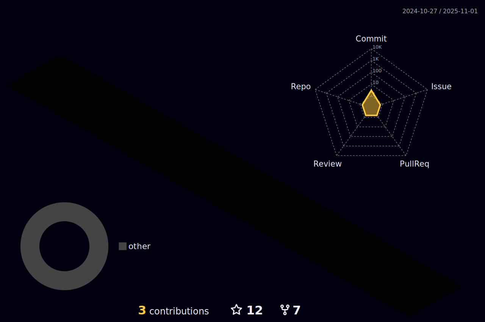

<!-- Banner -->

  

<!-- Header with 'Hello There' gif and introduction -->
<h1 align="center"> Hello There  </h1>

<!-- Introductory paragraph about who I am, my background, and expertise -->

I work at the intersection of data, business, and problem solving. With a B.Tech in Computer Science & Engineering and a specialization in Data Science, I focus on turning raw, complex data into insights that support better decisions across teams. My experience spans audit analytics, business analysis, and product-focused data work, giving me a balanced view of both technical depth and business impact.

<!-- Paragraph describing my learning journey and certifications -->

In my current role in Digital Assurance & Transparency – Data Analytics at PwC, I work with large financial datasets, run data driven audit procedures, and build analytical outputs that help teams assess risk and validate business performance. Along the way, I’ve strengthened my skills in SQL, Python, Excel, Power BI, and Tableau, while learning to communicate findings clearly and work closely with cross-functional teams.

<!-- Emphasizing my passion and openness to job opportunities -->

Outside of work, I’ve completed projects that cover sales analytics, customer behavior analysis, and predictive modeling ranging from identifying revenue-driving product segments to predicting Falcon 9 landing outcomes using machine learning. These projects sharpened my ability to structure messy data, build dashboards, and extract insights that move metrics.

<!-- Statement expressing eagerness for internships and job opportunities -->

Before PwC, I worked in an Agile Scrum team at CodeClouds IT Solutions, where I helped optimize web applications using Python and Django. That experience taught me how to gather requirements, respond to feedback, and deliver user-focused solutions efficiently.

<!-- Encouraging connections for collaboration or job roles -->

I’ve also strengthened my foundation with industry-recognized certifications in data analytics, machine learning, SQL, and Python from IBM, Stanford, UC Davis, and DeepLearning.AI.

Skills at a glance:
SQL · Python · Power BI · Tableau · Excel · Data Cleaning · KPI Dashboards · A/B Testing · Business Analysis · Agile · Documentation · ML & LLMs

I’m always open to opportunities in data analysis, business analysis, and product analytics roles where thoughtful problem solving, curiosity, and clear insights actually matter.

If you’d like to connect or discuss something meaningful in the data space, I’m always open to a conversation.

<!-- GitHub streak stats section -->
<h1 align="center"> My Current Streak </h1>

  

<!-- GitHub stats section -->
<h1 align="center"> My GitHub Stats </h1>

<!-- Most used programming languages on GitHub -->
<h1 align="center"> Most Used Languages </h1>

<!-- Social media links section -->
<h1 align="center"> How to Reach Me </h1>

<!-- Connect with me section, featuring links to Twitter and LinkedIn -->
<table align="center" width="100%">
    </td>
    <td align="center">
      <h3>Connect with me:</h3>
      <table>
        <tr>
          <td align="left" width="300">

            

          </td>
	  <td align="left" width="300">

            

          </td>    
        </tr>
      </table>
	</td>
</table>

<!-- GitHub profile trophies section -->
<h1 align="center"> :trophy: Git Profile Trophies </h1>

<!-- 3D contribution chart section -->

